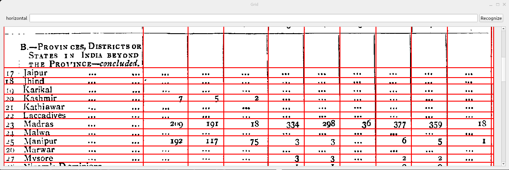
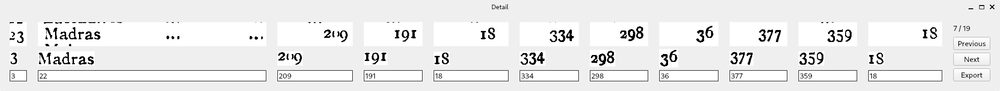

# Table Extractor

This program is intended to extract data from historical tables that are only available as a scan.
It was developed to work with tables of the British Administration in Myanmar, such as [this one](https://censusindia.gov.in/DigitalLibrary/data/Census_1931/Publication/Burma/45875_1931_TAB.pdf).

To ensure maximum data quality, the program works in a semi-automated way: 
While the program tries to automate detection as far as possible, it provides a GUI to manually edit all data.
At least with our samples manual post-processing was necessary, but this program greatly reduced processing time.

The processing of the original tables proceeds along the following steps:
* First the scanned PDFs are converted to PNGs which are then pre-processed. For this we rely on external programs.
* One then identifies the table lines in the original table.
* One then goes through each of the lines of the table and corrects the recognized data line by line.
* Finally, one can export the data as a machine-readable file, ready to be processed with R, python, etc.

Below we describe each of the steps in more detail


### File preparation
We assume there are two directories. One contains two subfolders `pdfs` and `pngs`, where `pdfs` contains all PDF files we want to work with. 
The second is a clone of this repository. 
We start by converting all PDFs to PNGs using `pdftoppm`:
```bash
cd pdfs
for file in *.pdf; do
  pdftoppm -png -r 300 $file "../pngs/${file%.pdf}"
done
cd ..
```

For transforming the PNGs we use the [OCRD pipeline](https://ocr-d.de/en/workflows).
For this we use the `ocrd` docker image.
We first download the image.
`docker run --rm -u $(id -u) -v $PWD:/data -w /data -- ocrd/all:maximum echo "hello world"`
Next start a bash shell within the docker image
`docker run -it --rm -u $(id -u) -v $PWD:/data -w /data -- ocrd/all:maximum /bin/bash`
We initialize an OCRD workspace and set an id for the workspace
`ocrd workspace init`
`ocrd workspace set-id someWorkspaceId`
We then add all files to the OCRD workspace
```bash
for file in pngs/*.png; do
  ocrd workspace add -g "$(basename $file .png)" -G pngs -i "$(basename $file .png)" -m image/png "${file}"
done
```
We are then ready to perform various preprocessing steps:
We first binarize the image, then crop it, then binarize again and finally deskew. 
```bash
ocrd-olena-binarize -I pngs -O pngs-bin
ocrd-tesserocr-crop -I pngs-bin -O pngs-crop
ocrd-olena-binarize -I pngs-crop -O pngs-bin2
ocrd-cis-ocropy-deskew -I pngs-bin2 -O pngs-deskew -P level-of-operation page
```
Each of these steps creates its own directory. We will work starting from the deskewed images. Based on your input images (and the availability of a GPU), you might want to consider additionally denoising or dewarping your images, for this see the documentation on the OCRD pipeline.

### Table Segmentation

We first need to properly segment the table into cells. For this we use the app provided here. You can start it with
```bash
python app/src/table_extractor/app.py path_to_an_image
```
There are various commandline options available from the help.
Once the program starts you will see something similar to the following screen:

In this screen you will want to identify the correct table lines. You can add lines by left-clicking and remove them by right-clicking. Pressing Shift switches between adding horizontal and vertical lines. 

Once you are satisfied with the table grid you can press Enter or the button in the top-right corner. The program will segment the table and call `tesseract` for OCR for each of the cells. You will then see the following UI.

The top image is the table cell, the image in the middle is an attempt at identifying characters in the cell and at the bottom you have an input that can be edited and is filled by the output of calling tesseract OCR.
You can switch between lines using the buttons on the right, check that all cells were recognized appropriately and export the data using the export button.

## Known limitations and improving results
* The identification of letters in a cell is rudimentary. If you want to improve it have a look at `contour_filters.py`.
* You can implement custom checks (e.g. sum constraints in table). For this see `datahandler.py` and in particular `check_row()`.
* To improve results you can change the tesseract language and also train you own models. For this you can also export the individual images, for more info see the `--keepfiles` option.
* Currently, this program only supports recognizing numbers - this can easily be changed, however in our use case restricting to number improved detection accuracy.